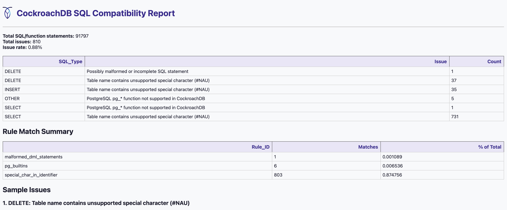
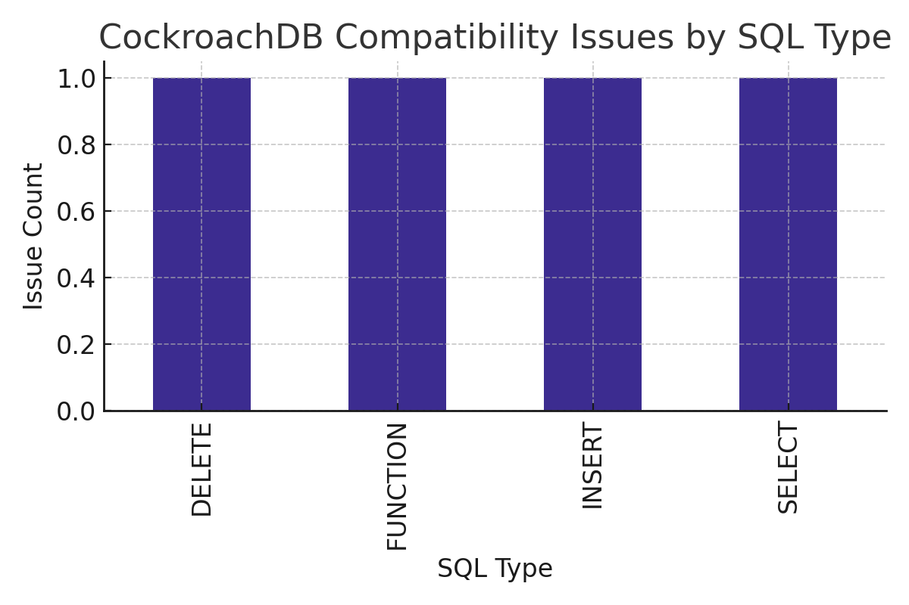
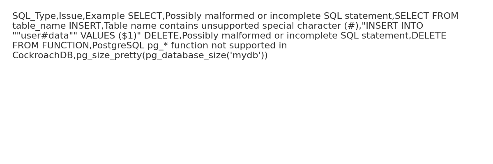
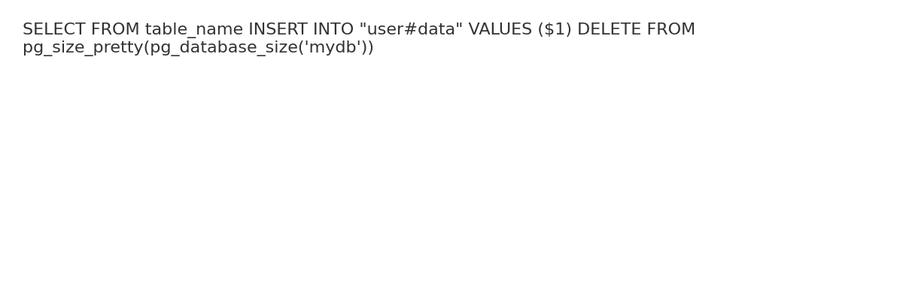
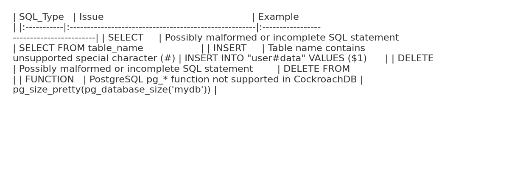

# crdb-sql-audit

A powerful CLI tool to extract, deduplicate, and analyze SQL logs for **CockroachDB compatibility** using a flexible, rule-based engine.

## 🚀 Features
- Works with **any SQL dialect** (PostgreSQL, MySQL, Oracle, etc.)
- Extracts SQL and function calls using customizable search terms (e.g. `execute`, `pg_`)
- Deduplicates repeated SQL statements from logs
- Analyzes SQL using a **YAML-based rule engine**
- Supports default compatibility rules (PostgreSQL ➜ CockroachDB)
- Allows **custom rule sets** via `--rules`
- Logs analysis output to both terminal and `crdb_sql_audit.log`
- Automatically detects SQL statement types (e.g. SELECT, DELETE)
- Friendly CLI with `--help` and `--version`
- Export full reports in multiple formats:
  - `.sql`: Deduplicated queries
  - `.csv`: Raw compatibility issue list
  - `.md`: Developer-friendly Markdown report
  - `.html`: Interactive browser report with sorting/filtering
  - `.png`: Visual bar chart of issues

## 🖼 Sample Output

| Report Type | Preview                                           |
|-------------|---------------------------------------------------|
| HTML        |  |
| Chart       |                |
| CSV         |                |
| SQL         |                |
| Markdown    |            |


## 📦 Installation

### Option A: Local Dev Install
```bash
git clone https://github.com/your-org/crdb-sql-audit.git
cd crdb-sql-audit
python -m venv venv
source venv/bin/activate
pip install .
```

### Option B: Build via `pyproject.toml`
```bash
python -m build
pip install dist/crdb_sql_audit-0.2.0-py3-none-any.whl
```

## 🧪 Usage
```bash
crdb-sql-audit \
  --dir /path/to/logs \
  --terms execute,pg_ \
  --out output/report
```

### Additional Options
```bash
--rules    Path to YAML rules file (optional, default: built-in PostgreSQL rules)
--help     Show usage help
--version  Show current version
```

### Custom Rules Example
```bash
crdb-sql-audit \
  --dir ./logs \
  --terms execute,pg_ \
  --rules ./rules/mysql_to_crdb.yaml \
  --out output/mysql_report
```

> 💡 This tool supports auditing **any SQL dialect** — just provide a rule set for your source database (e.g., PostgreSQL, MySQL, Oracle).

## 📁 Output
```
output/
├── report.sql          # Deduplicated SQL
├── report.csv          # Compatibility issues
├── report.md           # Markdown summary
├── report.html         # Interactive dashboard
├── report_chart.png    # Visual chart of issues
├── crdb_sql_audit.log  # Full run log
```

## 🧹 Preparing Your Log Files

To analyze SQL logs effectively, we recommend the following preprocessing steps:

### 1. Extract SQL-related Lines
```bash
grep "execute" app.log > sql_only.log
# or to include pg_ built-in function usage:
grep -E "execute|pg_" app.log > sql_only.log
```

### 2. Split Into Manageable Chunks (Optional but Recommended)
```bash
split -b 50M sql_only.log chunks/sql_chunk_
```

### 3. Run the Audit
```bash
crdb-sql-audit --dir chunks --terms execute,pg_ --out output/report
```

## 📚 Rule Engine Format

Rules are written in YAML and matched against each SQL line. Example:

```yaml
- id: malformed_dml_statements
  match: '^(SELECT|INSERT|UPDATE|DELETE FROM)\s*$'
  message: "Possibly malformed or incomplete SQL statement"
  level: warning
  tags: [syntax]

- id: special_char_in_identifier
  match: '"[^"]+#NAU"'
  message: "Table name contains unsupported special character (#NAU)"
  level: error
  tags: [table, identifier]

- id: pg_builtins
  match: '^.*\bpg_\w+\s*\(.*$'
  message: "PostgreSQL pg_* function not supported in CockroachDB"
  level: error
  tags: [function]

- id: low_token_sql
  match: '^(\S+\s*){1,2}$'
  message: "Extremely short SQL likely malformed"
  level: warning
  tags: [syntax]
```

> 📦 Multiple rule sets can be created to target different SQL dialects (e.g., `postgres_to_crdb.yaml`, `mysql_to_crdb.yaml`, etc.)

## 🧪 Validate Your Regex Rules

### 🔍 Online (Recommended)
Use [regex101.com](https://regex101.com/?flavor=python) to test your patterns:
- Set the **flavor to Python**
- Paste your rule into the regex field
- Paste a sample SQL line into the test area

### 🐍 In Python
You can also test your rules directly:
```python
import re
pattern = re.compile(r'^.*\bpg_\w+\s*\(.*$', re.IGNORECASE)
sql = "SELECT pg_backend_pid()"
print(bool(pattern.search(sql)))  # ✅ True
```
